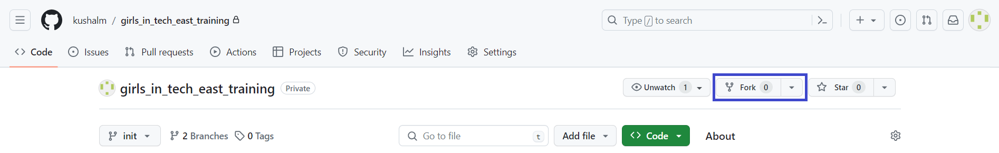
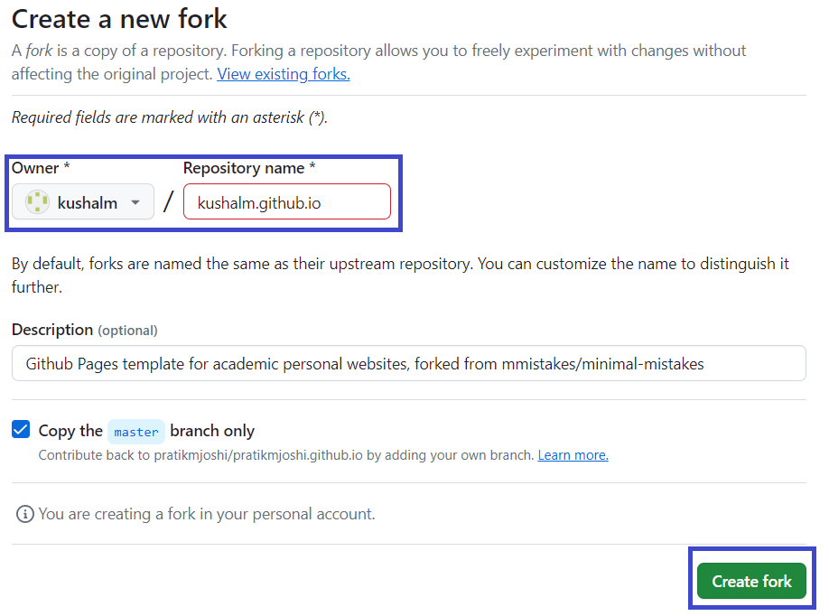
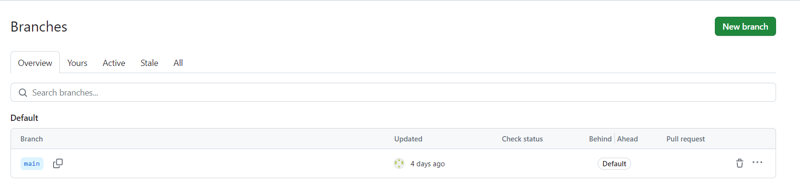
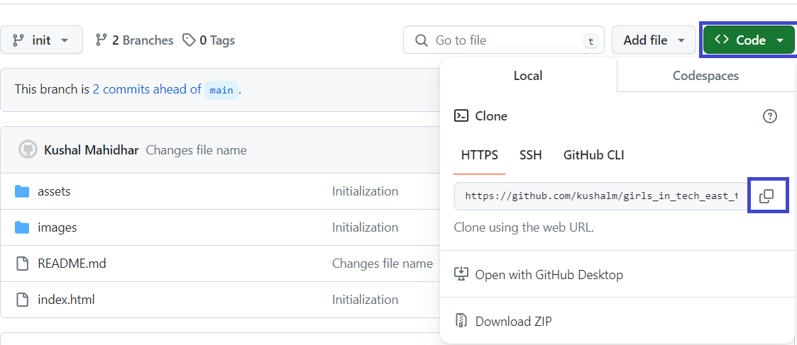
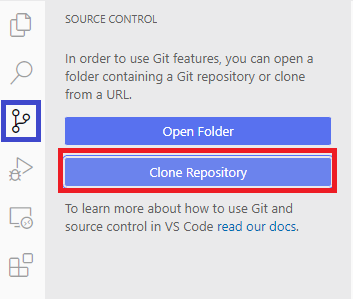
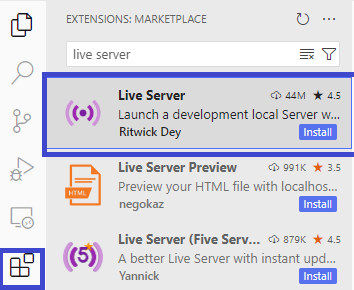
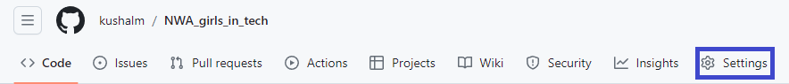
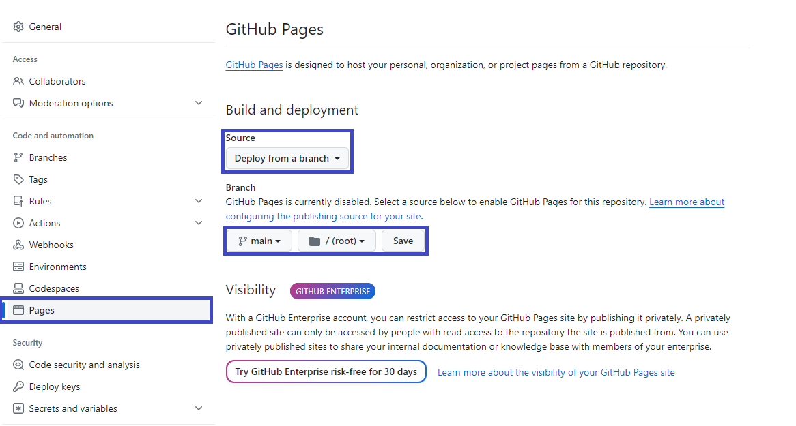

## Prerequisite

- [ ] Have an email ID (preferably a personal email that provides long-term access)
- [ ] Install [Git version control system](https://git-scm.com/book/en/v2/Getting-Started-Installing-Git)
- [ ] Install [VS Code](https://code.visualstudio.com/download) 
- [ ] A profile picture
- [ ] Small write-up introducing yourself
- [ ] Create icon for website
- [ ] A resume (optional)

## Git Basics

### What is Git? 
Git is a free and open-source version control system that helps you manage and track changes to your files and projects. It is mainly used by software developers, but it can also be handy for any individuals or teams working on collaborative projects or writing code.

Imagine you're working on a group project with your classmates. Each of you is responsible for different parts of the project, and you need to combine your work together to create the final result. But what if you all make changes at the same time? Or what if someone accidentally deletes an important section of the project? That's where Git comes in.

Git allows you to keep track of all the changes made to your project. It creates a timeline, or "history," of every modification made to your files. 

But Git isn't just about keeping track of changes; it also allows for collaboration among your team members. You can all work on different parts of the project simultaneously without overriding each other's work.

### Basic Git terms: 
- Repository: A repository, often called a "repo," is a storage location where Git keeps all the files and history of a project. It contains all the code and resources for the project.

- Commit: A commit is a way to save changes to your Git repository. It represents a specific version of your project. You make a commit when you want to record your changes and save them permanently in the repository's history.

- Branch: A branch is a separate line of development in Git. It allows you to work on different features or fixes without affecting the main project. Creating a branch helps keep your changes isolated until they are ready to be merged into the main project.

- Merge/Pull: Merging is the process of incorporating changes from one branch into another. When you have finished working on a feature or bug fix in a branch, you can merge it back into the main branch (often called the "master" branch) to combine the changes with the rest of the project.

- Clone: Cloning means creating a local copy of a remote Git repository on your computer. Cloning allows you to have a complete copy of the project and its history so that you can work on it, make changes, and contribute back to the repository.

- Fork: Forking and cloning are both related to creating copies of a Git repository, but they serve different purpose. When you fork a repository, you create an independent copy of the entire project under your own account. The forked repository becomes part of your repositories, and you have full rights and control over it.

- Pull: Pulling is the action of retrieving the latest changes from a remote repository to your local repository. It updates your local copy of the project, ensuring you have the most up-to-date version before you start making changes or continue working on the project.

- Push: Pushing is the opposite of pulling. It is the action of sending your local commits to a remote repository. When you are ready to share your changes with others, you push your committed changes to the remote repository so that others can access and merge them.

- Remote: A remote is a copy of a repository that resides on a server or another computer. It allows multiple developers to collaborate on the same project by sharing their changes through pushes and pulls.

## How do I use Git/Github to create a website?

We will be using GitHub pages, a feature of GitHub that allows users to host and publish their websites or web applications directly from their GitHub repositories. It provides a simple and free way to create and share your own website without the need for external hosting services.

\
To create a portfolio website using GitHub Pages, follow these steps:

1. Create a GitHub Account

2. Fork the template

3. Customize the Template

4. Push Files to Your Repository

5. Publish Your Website

## Setup

### Creating a Github account

1. Navigate to [Github.com](https://github.com/) and click on "Sign up"
2. Follow the prompts to create a new account.

### Creating a repository

As discussed earlier, we will fork the template repository to create your repository. Navigate to [this repo here](https://github.com/kushalm/kushalm.github.io) to fork it.

Click on "Fork" button on the top right.  

On the next page, name the repository as your-username.github.io to create a repo for your portfolio website.

| :exclamation:  Dont forget to rename the repo   |
|-----------------------------------------|

### Creating a new branch

Never code on the main branch. Always use a feature branch. 

### Using your repo

Once you have created your repo, we will clone(download) it to your computer. Click on the code button on the top right and copy the URL displayed. 

## Setting up VS Code

Open Visual Studio Code or, also called VS Code. 

Click on the source control tab on the left. And paste the URL of your repo in the prompt. 

Go to the extensions tab, and download an extension called "Live Server". 

## Customizing the code

Add your resume to the assets folder. Images to the images folder. 

Edit the index.html 

As you make changes, save the changes. View and verify your changes in the browser by running the live server. Press the Go Live button on the bottom right of your window. 

## Customizing the icons

1. Navigate to the [icon generator webiste.](https://favicon.io/favicon-generator/). 

2. Enter your initials in the Text Box.

3. Select the Font color and the background color.

4. Select the Font. You can preview the options at [Google Fonts](https://fonts.google.com/)

5. Select the variant and font Size. 

6. Note down these settings somewhere so you can re-create later. 

## Saving the code

Once you have made satisfactory changes, we promote the code to staging by running the command "git add ." in the terminal. 

After that, we commit our changes by running the command "git commit -m 'commit message' ". Then we copy our code to Github by running the command "git push". 

## Publishing the website

 1. On GitHub, navigate to your site's repository. 

 

 2. On the left column, in the "Code and automation" section of the sidebar, click "Pages".
 3. Under "Build and deployment", under "Source", select "Deploy from a branch".
 4. Under "Build and deployment", use the branch dropdown menu and select "main".

 